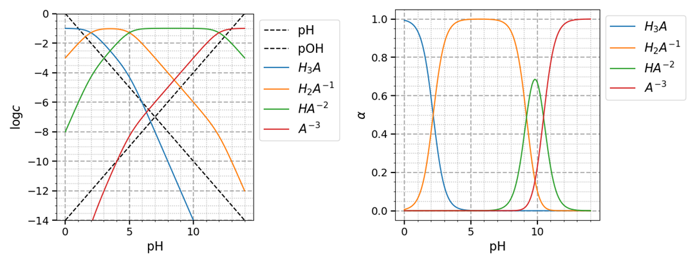

# pH diagrams

A simple script to plot pH diagrams. pH diagrams describes acid–base equilibria.
pH-log c diagrams show the logarithmic dependence of concentration with pH.
Species distribution diagrams show the degree of dissociation as a function of pH.

# Installation and requirements

This project relies mainly on [Matplotlib](https://matplotlib.org/) and [Numpy](https://numpy.org/).

Just clone or download this repo. This is not a package yet. 

# Contributing

All contributions are welcome.

**Issues**

Feel free to submit issues regarding:

- recommendations
- more examples for the tutorial
- enhancement requests and new useful features
- code bugs

**Pull requests**

- before starting to work on your pull request, please submit an issue first
- fork the repo
- clone the project to your own machine
- commit changes to your own branch
- push your work back up to your fork
- submit a pull request so that your changes can be reviewed

# Testing

Tests can be run in the top-level directory with the command `pytest -v tests/`.

# Citing

If you use this project in a scientific publication or in classes, please consider citing as

F. L. S. Bustamante & H. B. Soares & N. O. Souza, pH diagrams, 2021 - Available at: https://github.com/natashaosouza/pH-diagrams